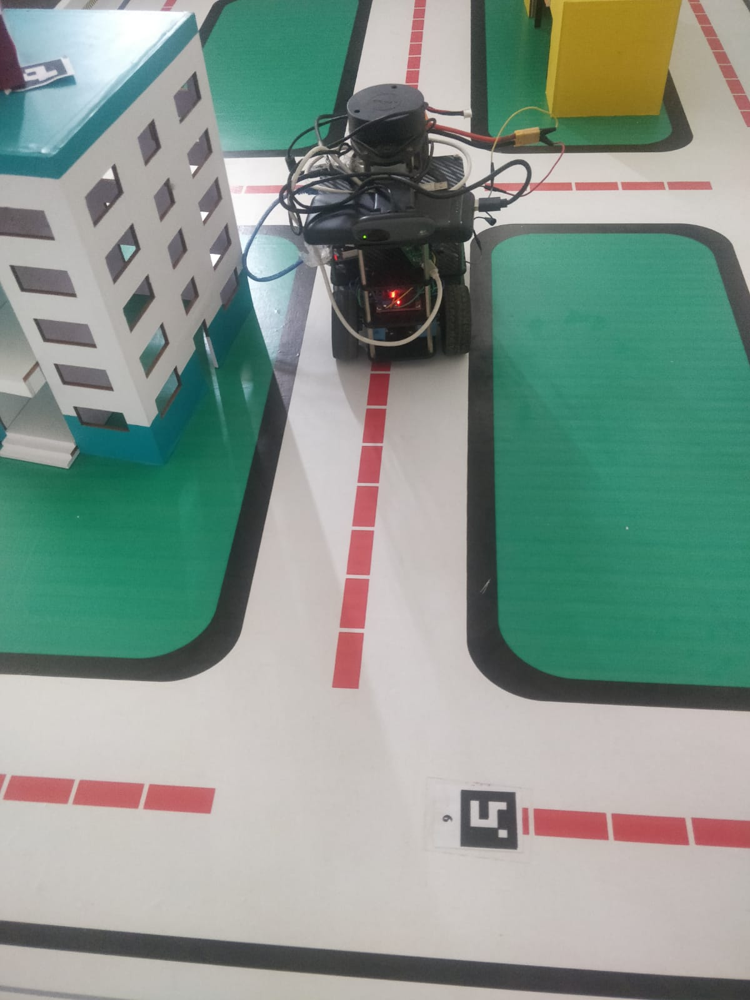
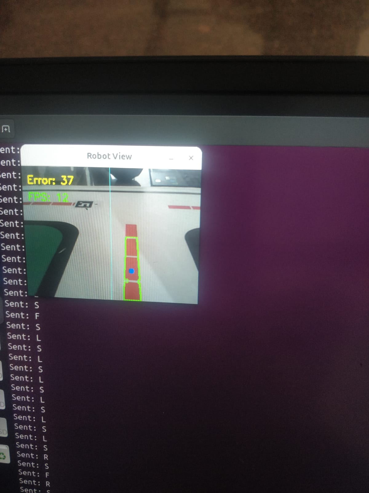
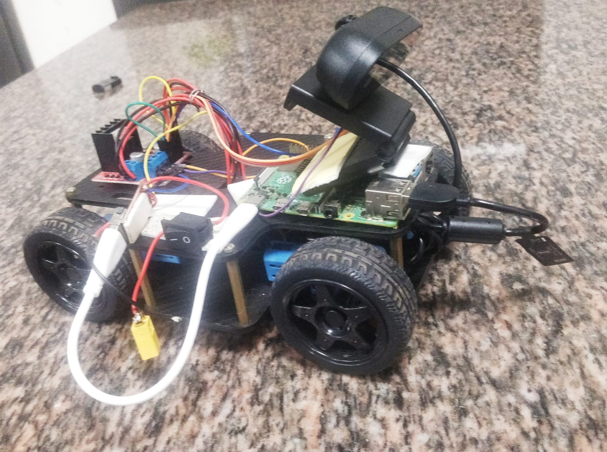
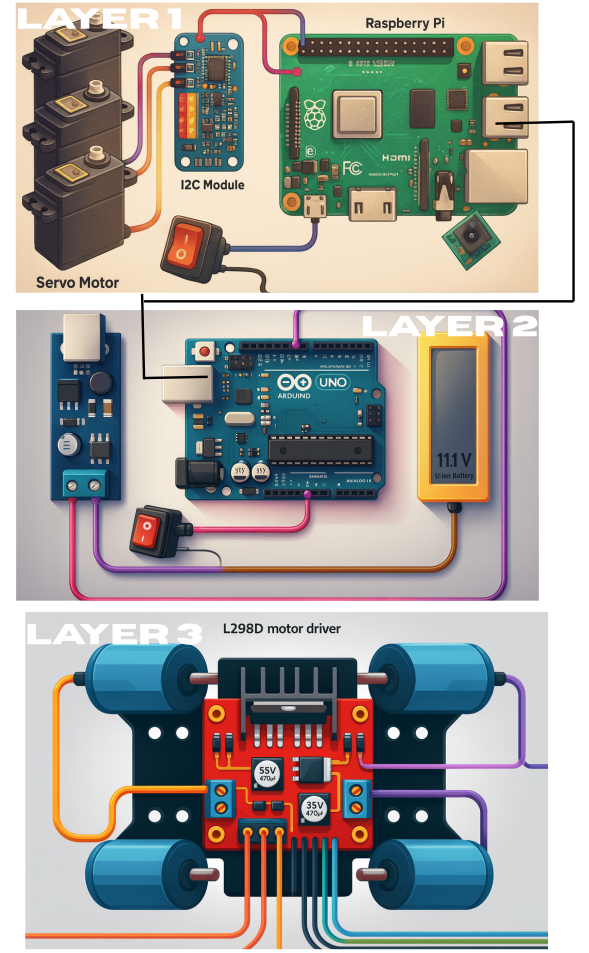
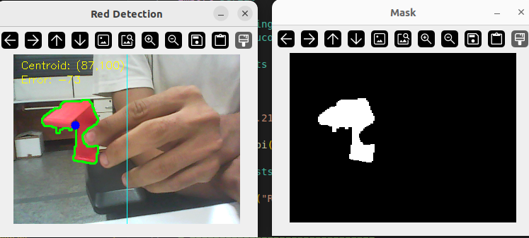
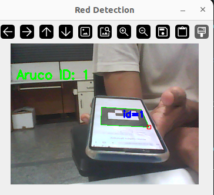

# 🚗 Lane Following Bot with ArUco Tag Detection using Camera

A vision-based autonomous mobile robot capable of following a **red lane** and detecting **ArUco tags** using a USB camera.  
The system combines embedded motor control with computer vision for intelligent navigation.

  

---

## 📌 Project Overview

This project demonstrates a hybrid robotics architecture where:

- **Raspberry Pi** performs vision processing  
- **Arduino Nano** handles motor control  
- **USB Camera** detects:
  - Red lane for navigation
  - ArUco tags for identification / decision making  

The robot follows a predefined red path and reacts based on visual tag inputs.

  

---

## ⚙️ Hardware Used

- Arduino Nano  
- Raspberry Pi  
- L298D Motor Driver  
- USB Camera  
- DC Motors  
- Robot Chassis  
- Battery Pack  

---

## 🧠 System Architecture

| Component        | Function                          |
|------------------|-----------------------------------|
| Raspberry Pi     | Image processing & decision making|
| USB Camera       | Lane & ArUco detection            |
| Arduino Nano     | Motor control                     |
| L298D Driver     | Drives DC motors                  |
| OpenCV           | Image processing                  |
| ArUco Library    | Marker detection                  |

  

---

## 🧠 Connection Diagram

  

---

## 🚦 Features

- Red Lane Detection using Computer Vision  
- Autonomous Path Following  
- ArUco Tag Detection  
- Real-time Motor Control  
- Raspberry Pi → Arduino Serial Communication  

  

  

---

## 🔍 Working Principle

1. USB camera captures real-time video  
2. Raspberry Pi detects:
   - Red colored lane
   - ArUco markers  
3. Based on lane position:
   - Left / Right correction is calculated  
4. Commands sent to Arduino Nano  
5. Arduino controls motors using L298D  

---

## 🛠️ Software Used

- Python (OpenCV)  
- Arduino IDE  
- Serial Communication  
- ArUco Detection Library  

---

## 📦 Output

- Robot follows red lane autonomously  
- Detects ArUco tags in real time  
- Adjusts movement based on lane position  

---

## 🚀 Applications

- Autonomous navigation  
- Smart warehouse robots  
- Educational robotics  
- Vision-based AGVs  

---

## 👨‍💻 Author

Pulkit Garg  
Robotics Facilitator | Autonomous Systems Enthusiast  
